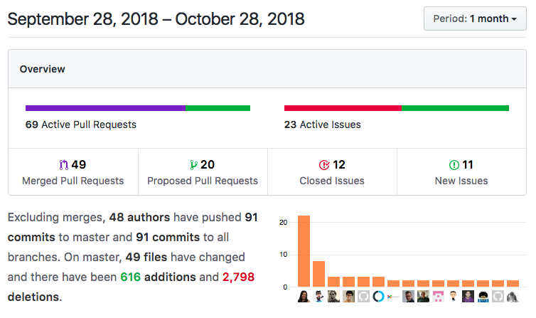
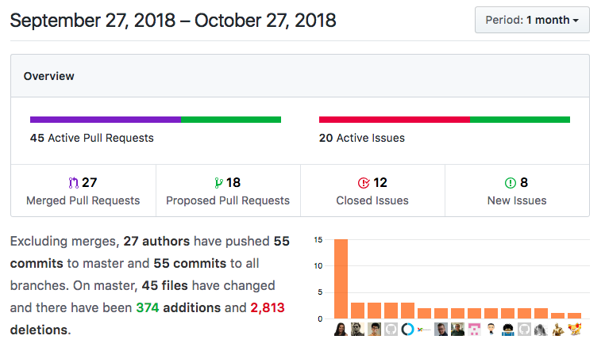
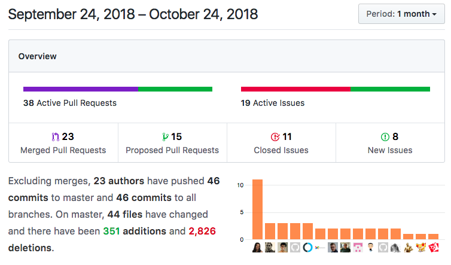
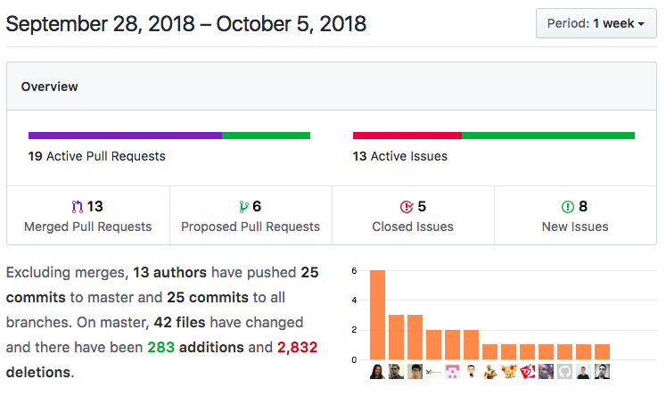

## Changelog

2018-10-28

3 more days!

- Color changing ~~potion~~ background
- Mysterious ghost
- Halloween costume generator
- Halloween fact generator
- Pumpkin favicon

And here are the stats so far!

***

2018-10-27

It's the last weekend before Halloween.

- Konami code (added a while ago, but I've confirmed it works :ghost: )
- Corrected countdown logic (it was off by one day)
- Added styling for improved visuals on mobile
- Minor text edits and bug fixes

And here are the stats so far!

***

2018-10-24

One week until we arrive in Halloween town!

- Cauldron illustration
- Pumpkin favicon
- Readme banner image
- Shields
- Minor text edits and bug fixes

And here are the stats so far!

***

2018-10-5

First week and we're off! Here are the changes from this week

- Add spooky Text
- Update counter logic to Moment.js
- Issue template added
- Pull request template added
- Ghost emoji

And here are the stats

